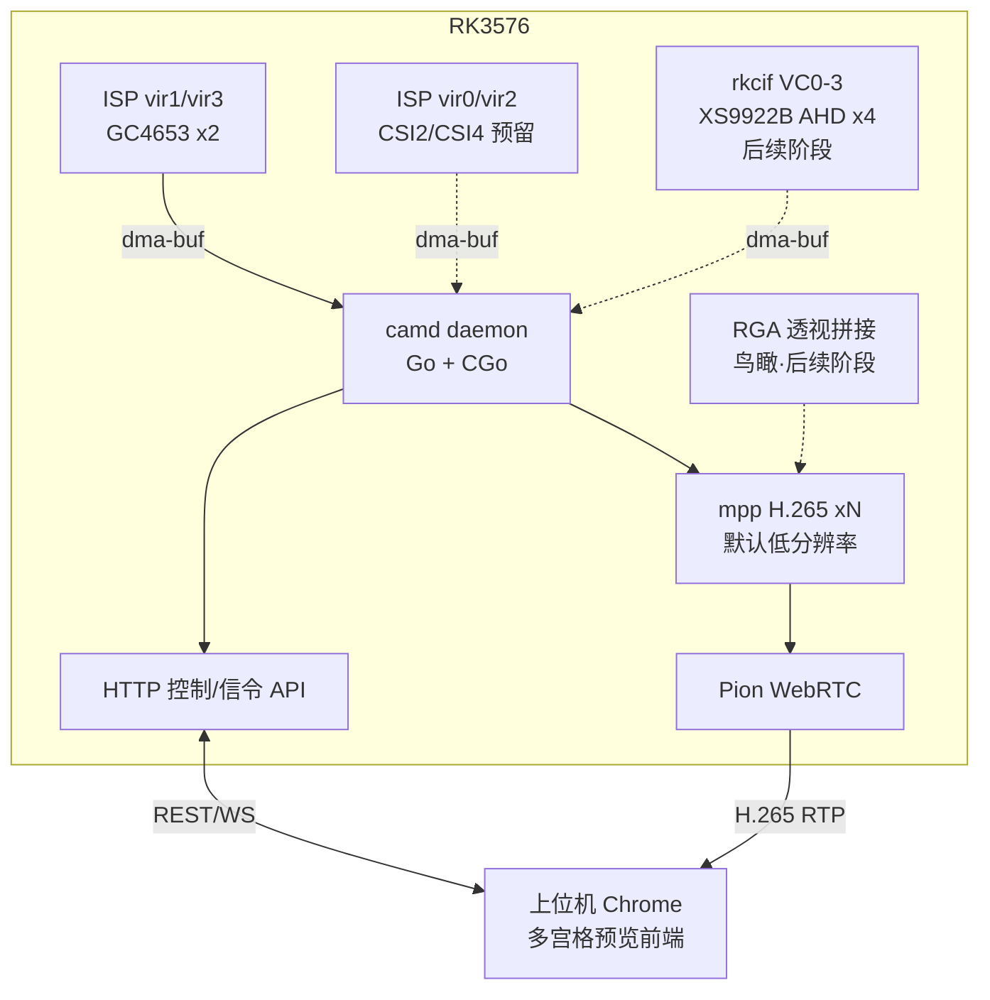

# 多路摄像头 WebRTC 预览 — 可行性评估

> 目标平台：鲁班猫3（RK3576，8 核，3.8GB 内存），Ubuntu 22.04，内核 6.1.99-rk3576（Rockchip BSP）。
> 本文结论均来自开发板实测（设备树 / media 拓扑 / debugfs）与 XS9922B 参考驱动资料，调查时间 2026-08。
> 板上配置过程详见 `../../../docs/board_setup.md`。

## 1. 需求与资源对照

| 需求 | 涉及硬件资源 | 结论 |
|---|---|---|
| 4 路 RAW 摄像头（GC4653×2 已接，CSI2/CSI4 预留） | ISP（rkisp） | **可行**，单 ISP 硬件时分复用，吞吐为主要瓶颈，需降规格缓解 |
| 4 路 AHD（XS9922B @ CSI0，4 虚拟通道） | rkcif（VICAP） | **可行**（后续阶段），完全绕过 ISP |
| 8 路独立 H.265 流 + 1 路环视流 | rkvenc（编码器） | **可行但需分级编码**：全部 1080p30 同时编码会触顶，默认低分辨率 + API 按需提升 |
| 环视拼接（4 路 AHD 合成鸟瞰） | RGA | **可行**（后续阶段），余量充足 |
| 全程零拷贝、低延迟 | dma-buf 管线（V4L2 → mpp） | **可行**，自研 daemon 直接 ioctl + mpp，规避已验证的 ffmpeg v4l2 indev 连续流问题 |

## 2. 硬件能力实测结论

### 2.1 ISP：1 硬件 + 6 虚拟实例

设备树实测（`/proc/device-tree`）：

- 1 个硬件实例 `isp@27c00000`（compatible `rockchip,rk3576-rkisp`）
- 6 个虚拟实例 `rkisp-vir0` ~ `rkisp-vir5`（`rockchip,rkisp-vir`），当前仅 vir1（CAM1→/dev/video22, media2）、vir3（CAM3→/dev/video31, media3）随摄像头 overlay 启用

**含义**：多路 RAW 摄像头共享同一个 ISP 硬件，靠时分复用轮流处理。4 路 RAW 在拓扑上可行（每路 vir 实例各自输出独立 video 节点），但 **ISP 总吞吐是所有 RAW 通道共享的**。

**瓶颈估算**：4 路 GC4653 满规格 2560x1440@30 ≈ 442 Mpx/s 输入，超出单 ISP 硬件的实时处理能力的风险高。

**缓解手段**（按优先级）：

1. ISP mainpath 直接输出预览所需低分辨率（ISP 内部 scaler 下采样，但仍需按输入全分辨率逐帧处理，只能省输出带宽，不能省 ISP 处理量）——缓解有限
2. GC4653 降 mode（驱动支持更低分辨率/更高 binning 的 mode 时）或降低采集帧率（如 15fps）——最有效的缓解
3. 减少同时在线的 RAW 路数（远程驾驶场景中 AHD 4 路才是环视主力，RAW 通道可按需开关）

### 2.2 编码器：双核 rkvenc

- `rkvenc-core@27a00000` + `rkvenc-core@27a10000`（compatible `rockchip,rkv-encoder-rk3576-core`），mpp 按任务负载自动分配双核
- ffmpeg-rockchip `hevc_rkmpp` 已验证可编码 2560x1440@30（板端实测 5s/150 帧，约 7.8Mbps @ 8M 目标码率）

**吞吐估算**（双核总量约 4K@60 ≈ 500 Mpx/s 级别）：

| 场景 | 像素吞吐 | 评估 |
|---|---|---|
| 8 路 × 1080p30 | ≈ 497 Mpx/s | **触顶**，叠加环视流必超限，不可行 |
| 8 路 × 720p30 + 环视 1080p25 | ≈ 283 Mpx/s | 余量充足，**采用为默认配置** |
| 单路按需 1080p（其余 720p） | ≈ 320 Mpx/s | 可行 |

**策略**：每路通道默认 720p（或更低）编码；分辨率/码率/帧率均通过 API 控制，需要高清的通道由调用方显式提升。放大查看为纯前端缩放，不触发板端规格变化。

### 2.3 RGA：双核，余量充足

- `rga@27920000`、`rga@27930000` 双核，`/dev/rga` 可用，rkrga debugfs 显示 2 个 scheduler 空闲
- 后续阶段环视：4 路 1080p@25 透视变换 blit 到一张鸟瞰画布（远小于 8192×8192 上限），异步提交 4 次 im2d 调用，负载远低于 RGA 能力

### 2.4 MIPI 带宽（CSI0 / XS9922B，后续阶段）

- XS9922B：4 lane × 1.5 Gbps 连续时钟 ≈ 6 Gbps 理论带宽
- 4 × 1080p25 UYVY（16bit/px）≈ 3.3 Gbps（30fps ≈ 4 Gbps），单条 CSI0 可承载
- rkcif 每个 mipi 入口的 `stream_cif_mipi_id0~3` 实体天然支持按 VC 分出 4 路独立 video 节点

### 2.5 内存

3.8GB。9 路 NV12 720p 帧缓存（每帧约 1.4MB，每路 16 buffer ≈ 200MB）+ dma-buf 流转，充足。

## 3. 逐项可行性

### 3.1 4 路 RAW 摄像头 —— 可行（有条件）

- CSI2/CSI4 接入摄像头并启用对应 overlay 后，各出独立 `rkisp-vir` 节点，拓扑与现有 vir1/vir3 相同
- **风险**：单 ISP 时分复用吞吐（见 2.1）；rkaiq 需为每路 sensor 独立 3A（`rkaiq_3A_server` 支持多摄，`/etc/iqfiles` 已有 `gc4653_YT10120_30IRC-4M-F20.json`）
- **本期**：仅用已接的 2 路（/dev/video22、/dev/video31）跑通闭环；CSI2/CSI4 留配置扩展位

### 3.2 AHD 4 路独立流 + 环视流同时输出 —— 可行（后续阶段）

- XS9922B 输出 `MEDIA_BUS_FMT_UYVY8_2X8`（YUV422 packed），经 rkcif 按 VC0~3 分出 4 路独立 video 节点，**完全不占 ISP**
- UYVY 可被 RGA / mpp 直接消费（mpp hevc 编码器接受 uyvy422/nv16 输入），编码前无需 CPU 转格式
- 环视流是这 4 路帧的 RGA 派生物：采集一次，同时送"4 路独立编码通道"和"RGA 拼接 → 第 9 路编码"，编码总量受默认低分辨率策略保护

### 3.3 XS9922B 30fps —— 依赖厂商配置

- 帧率由 AHD 摄像头模拟信号制式决定（1080p25 / 1080p30），需确认采购摄像头为 30fps 制式
- XS9922B 需厂商提供 1080p30 解码时序寄存器配置。参考表 `xs9922_reg_cfg_20211022.h` 仅 25fps；每通道 `0x010d = 0x44`（标注 timing，720p 为 0x40）与制式相关，但无公开寄存器手册，自行推导风险不可控
- 主控驱动侧改动小：`xs9922.c` mode 表新增 `max_fps=30` 的 mode + 指向新 reg_list；rkcif 与 MIPI 带宽无需改动
- **本期不移植驱动**，待厂商配置到位后与 AHD 接入一并实施。集成注意：参考驱动 include 的 `xs9922_reg_cfg.h` 与提供的 `xs9922_reg_cfg_20211022.h` 文件名及数组名（`xs9922_1080p_4lanes_25fps_1500M` vs `xs9922_1080p_4lanes_25fps`、`xs9922_mipi_reset` vs `xs9922_mipi_reset_new`）不一致，移植时需对齐

### 3.4 Chrome H.265 over WebRTC —— 可行（需确认浏览器版本）

- Chrome 136+ 原生支持 H.265 over WebRTC（需上位机 GPU 支持硬解 HEVC）
- **风险**：上位机 Chrome 版本过旧或无 HEVC 硬解时无画面；部署前在目标环境确认 `chrome://version` 与 `chrome://gpu`
- 按需求固定 H.265，不引入 H.264 备选

### 3.5 已知板端坑（来自 board_setup.md 实测）

1. **ffmpeg v4l2 indev 读 ISP 节点连续流会 EOF 卡死**（仅出 1 帧，输入被识别为 0.03fps）——自研 daemon 直接 V4L2 ioctl 采集可规避，这正是选择自研而非 ffmpeg 管道的依据之一
2. **vb2 缓冲队列必须 ≥16**：缓冲过少时消费抖动导致队列耗尽，rkisp 静默停止出帧（不丢帧、无 dmesg 报错），采集永久阻塞——daemon 采集队列固定 16 buffer
3. 编码码率：hevc_rkmpp 实测 8M 目标码率输出约 7.8Mbps，属正常偏差

## 4. 总体技术方案

- **每路管线**：`V4L2 采集（dma-buf，16 buffer）→ mpp H.265 编码（dma-buf 导入，零拷贝）→ RTP 打包 → Pion TrackLocalStaticSample 发送`；全程无 CPU 像素处理
- **技术栈**：Go（Pion WebRTC）+ CGo 薄 C 层（librockchip-mpp 1.5.0 / V4L2 ioctl），板端原生构建（aarch64，开发包已装）；前端纯静态 vanilla JS，daemon 直接托管
- **参数控制**：码率/GOP 走 mpp 运行时 set（不断流）；分辨率/帧率变更停流重建编码通道（先建新后拆旧，该路短暂重连，前端平滑过渡）
- **通道配置**：YAML 声明式摄像头清单（节点路径、类型 raw/ahd、默认参数），未连接通道前端显示离线占位；`ahd` 类型保留接口不实例化
- **环视（后续阶段）**：4 路 AHD 帧各自 RGA 透视变换 blit 到同一鸟瞰画布，变换参数存 JSON 手工调整；不做标定

## 5. 分阶段实施

| 阶段 | 内容 | 状态 |
|---|---|---|
| 一（本期） | 2 路 GC4653 跑通 采集→编码→WebRTC→前端 闭环；CSI2/CSI4/AHD 通道以离线占位存在 | 进行中 |
| 二（后续） | XS9922B 驱动移植 kernel 6.1 + CSI0 4VC overlay（内核源码从 `resources/sdk/LubanCat_Linux_Generic_SDK_20260729.tgz` 解压或从 `.repo` git pack 导出 kernel-6.1），调通 4 路 AHD | 待厂商 30fps 寄存器配置 |
| 三（后续） | RGA 环视鸟瞰拼接为第 9 路流，全链路联调 | 依赖阶段二 |

## 6. 风险登记

| 风险 | 等级 | 缓解 |
|---|---|---|
| 上位机 Chrome <136 或无 HEVC 硬解 | 中 | 部署前验证 `chrome://gpu`；机房/车端上位机统一浏览器版本 |
| 4 路 RAW 满规格同时采集 ISP 吞吐不足 | 中 | GC4653 降 mode/降帧率；RAW 通道按需开关；AHD 通道不占 ISP |
| ISP 静默停止出帧（vb2 队列耗尽） | 低 | 采集队列固定 16 buffer；daemon 监控帧超时自动重启该路管线 |
| XS9922B 无公开寄存器手册 | 中 | 30fps 配置向厂商索取；25fps 先用参考表跑通；驱动预留 mode 扩展点 |
| 内核源码未检出（驱动移植前置） | 中 | 阶段二先从 SDK tgz 解压或 `.repo` git pack 导出 kernel-6.1 |
